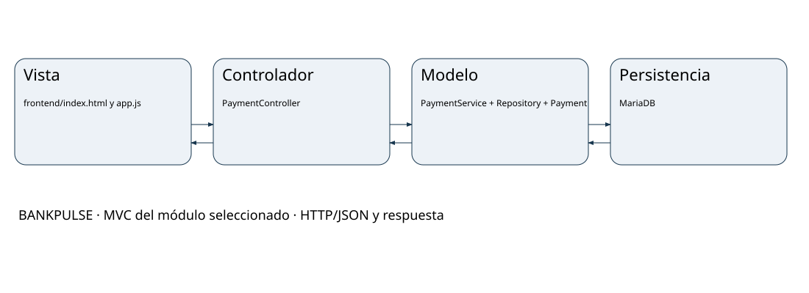

# MVC BANKPULSE

## Vista
frontend/index.html y app.js: pagos recientes, experiencia/garantía y Social Split. refreshCore(), renderPayments() y createPayment().

## Controlador
PaymentController: create() recibe body y X-Idempotency-Key; list() consulta pagos. Responde JSON mediante Spring MVC REST.

## Modelo
PaymentRequest, PaymentService, Payment, PaymentRepository; OutboxEvent y OutboxRepository participan en la transacción.

## Persistencia y límites
MariaDB, servicios payments-api y console. Auditoría mediante OutboxPublisher → audit-api → MongoDB queda fuera del sprint seleccionado.

## Justificación
Spring MVC se usa para una API REST; la Vista HTML/JS es externa y Nginx enruta hacia el servicio. PaymentController traduce HTTP, PaymentService decide idempotencia y transacción, y los repositorios JPA guardan entidades. No se usa una Vista Thymeleaf. El patrón adicional Outbox conserva pago y evento en la misma transacción. MVC describe el módulo de pagos dentro de una plataforma de microservicios, no reemplaza su arquitectura completa.

## Límites
La interfaz registra 201 en su traza visual, aunque create() devuelve ResponseEntity.ok: la respuesta real es 200. El sprint prueba reintento secuencial idéntico; conflicto con datos distintos y garantías ante carreras concurrentes necesitan trabajo adicional.

